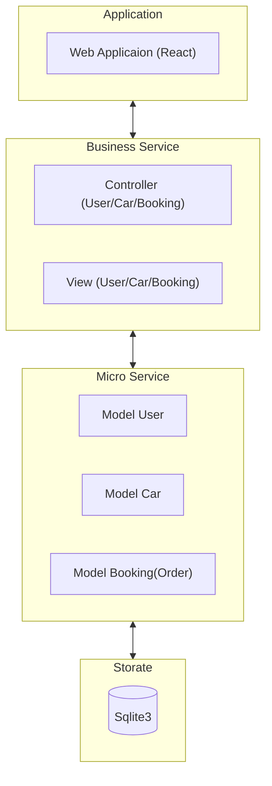

# Automated Car Rental System

This is an **Automated Car Rental System** (ACRS) that aims to design and implement a system to make the process of car rental and management being easy to execute, and to lower the possibility of faults happening. ACRS is designed by **client-server** artechitecture, having **front-end** to provide user with user interfaces and interactions and **back-end** to store information of `Car`, `User` and `Order`, and the system maintains a **layered architecture** to distinguish particular functions for each layer. 

- `User` subsystem stores and manage the user information by two different roles: `Admin` and `Customer`.
- `Car` subsystem is used to store and manage all the cars for ACRS.
- `Order` also means the `Booking` subsystem, to store and manange booking history between users and cars.


## Front-end

This provides users with interfaces and interactions to visit the system, which is designed based on `React.js` with `TypeScript`. 

**directory:**
```shell
    # React project
    ./client/rental-car-app 

    # A simple Node.js server to assist rental-car-app to run
    ./client/rental-car-node-server
```


## Back-end

The back-end services all programmed by `Python` language, using `fastapi` and `uvicorn` to support http request to `FE`, using `pydantic` to easily do data transformation, applying `sqlite3` to work as database to store all the information. This part is designed by `MVC (Model-View-Controller)` architecture.

- **Model** - to keep connection to `database`, operate it and format the data to `Controller`,
- **View** - to compose and store the information needed to display on front-end,
- **Controller**  - to organise the business by composing multiple parts of data from `Model` with logic and outcoming `View` data structure.


**directory:**
```shell
    ./server
```

## Layers architecture

ACRS is designed by 4-layers: `Application`, `Business service`, `Micro-service`, `Storage`.



### 1. Application:

It currently provided by web application, having 3 parts: `user`, `order(booking)` and `car` to interact with the system.


### 2. Business service:

To organise the logic of business to ensure the fluent performance between users and data, including `Controller` and `View`.

### 3. Micro-service:

This part remains connection to `database` and separates all services into 3 different `Models`: `User`, `Car` and `Booking(Order)`, each of them provide atomic services to visit database and to parse information from database to data elements to be applied to `Controller`.


### 4. Storage:

It has similar isolated parts as `Micro-service`: `User`, `Car` and `Booking(Order)`, and supports actions to visit database. The design of this part maintains a multi-selection of different databases, such as `Sqlite3`, `MySql` etc. Just by following the execution of `Sqlite3`, any database can be supported.

## Project structure
```text
yb_car_rental_system            # Root directory
├── client                      # Front-end
│   ├── rental-car-app          # React project (web)
│   │   ├── public
│   │   └── src
│   │       ├── assets
│   │       ├── components
│   │       └── pages
│   └── rental-car-node-server  # A simple Node.js server to assist to support React project to run
└── server                      # Back-end
    ├── db                      # Database
    ├── exception               # Exception definition
    ├── lib                     # Library for global use
    │   ├── logger
    │   ├── response
    │   └── utils
    ├── notification            # Notification to notify changes to observers.
    └── service                 # Services 
        ├── controller          # Business Layer: business composer
        ├── model               # Micro-service Layer: atomic data operation
        └── view                # Business Layer: data structure definition used to response requests.

```


## Setup environment

All the following environment is set up for Mac OS as an example.

#### install node if needed

```shell
    brew install node
```

### init client modules

```shell
    # react project
    cd client/rental-car-app
    npm install
    # or npm i

    # node.js project
    cd client/client/rental-car-node-server
    npm install
    # or npm i
```

### python running dependencies

Install all the dependencies if needed.

```shell
    python -m pip install fastapi uvicorn pydantic
    # or pip install fastapi uvicorn pydantic
```


## Installation

### client install

After performing the following command, it will print the way to visit the web site.

```shell
    bash ./client/install.sh
```

### server install

```shell
    cd server
    python server.py [host] [port]
```


## Known issues

None currently, if you have any issues, please email me.


## About me

Email: shuohui1022@gmail.com


## License

```text
MIT License

Copyright (c) 2026 Shuohui (Enfrai)

Permission is hereby granted, free of charge, to any person obtaining a copy
of this software and associated documentation files (the "Software"), to deal
in the Software without restriction, including without limitation the rights
to use, copy, modify, merge, publish, distribute, sublicense, and/or sell
copies of the Software, and to permit persons to whom the Software is
furnished to do so, subject to the following conditions:

The above copyright notice and this permission notice shall be included in all
copies or substantial portions of the Software.

THE SOFTWARE IS PROVIDED "AS IS", WITHOUT WARRANTY OF ANY KIND, EXPRESS OR
IMPLIED, INCLUDING BUT NOT LIMITED TO THE WARRANTIES OF MERCHANTABILITY,
FITNESS FOR A PARTICULAR PURPOSE AND NONINFRINGEMENT. IN NO EVENT SHALL THE
AUTHORS OR COPYRIGHT HOLDERS BE LIABLE FOR ANY CLAIM, DAMAGES OR OTHER
LIABILITY, WHETHER IN AN ACTION OF CONTRACT, TORT OR OTHERWISE, ARISING FROM,
OUT OF OR IN CONNECTION WITH THE SOFTWARE OR THE USE OR OTHER DEALINGS IN THE
SOFTWARE.
```

