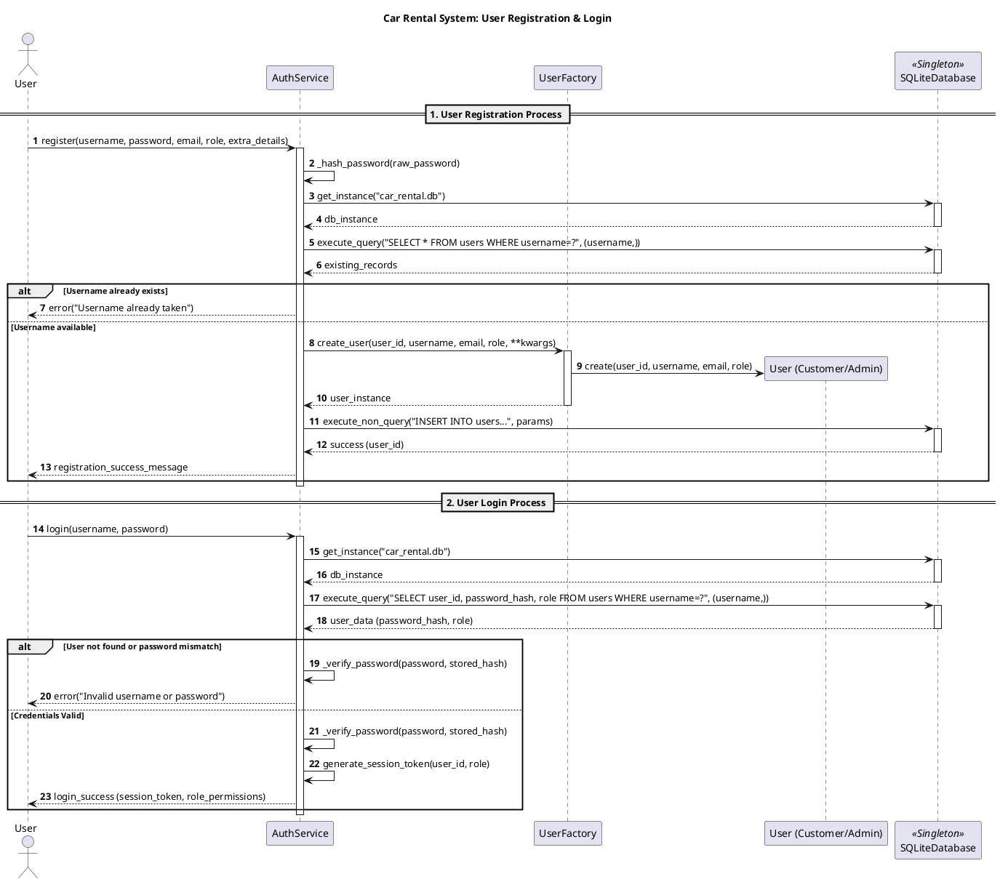

```plantuml
@startuml
title Car Rental System: User Registration & Login
autonumber
actor "User" as user
participant "AuthService" as auth
participant "UserFactory" as factory
participant "User (Customer/Admin)" as user_obj
participant "SQLiteDatabase" as db <<Singleton>>

== 1. User Registration Process ==
user -> auth : register(username, password, email, role, extra_details)
activate auth

' 密码安全哈希处理
auth -> auth : _hash_password(raw_password)

' 获取 SQLite 数据库单例
auth -> db : get_instance("car_rental.db")
activate db
db --> auth : db_instance
deactivate db

' 检查用户名/邮箱是否已存在
auth -> db : execute_query("SELECT * FROM users WHERE username=?", (username,))
activate db
db --> auth : existing_records
deactivate db

alt Username already exists
    auth --> user : error("Username already taken")
else Username available
    ' 工厂模式创建用户对象
    auth -> factory : create_user(user_id, username, email, role, **kwargs)
    activate factory
    factory -> user_obj ** : create(user_id, username, email, role)
    factory --> auth : user_instance
    deactivate factory

    ' 持久化写入 SQLite 数据库
    auth -> db : execute_non_query("INSERT INTO users...", params)
    activate db
    db --> auth : success (user_id)
    deactivate db

    auth --> user : registration_success_message
end
deactivate auth

== 2. User Login Process ==
user -> auth : login(username, password)
activate auth

auth -> db : get_instance("car_rental.db")
activate db
db --> auth : db_instance
deactivate db

' 查询用户信息及哈希密码
auth -> db : execute_query("SELECT user_id, password_hash, role FROM users WHERE username=?", (username,))
activate db
db --> auth : user_data (password_hash, role)
deactivate db

alt User not found or password mismatch
    auth -> auth : _verify_password(password, stored_hash)
    auth --> user : error("Invalid username or password")
else Credentials Valid
    auth -> auth : _verify_password(password, stored_hash)
    auth -> auth : generate_session_token(user_id, role)
    auth --> user : login_success (session_token, role_permissions)
end
deactivate auth

@enduml
```