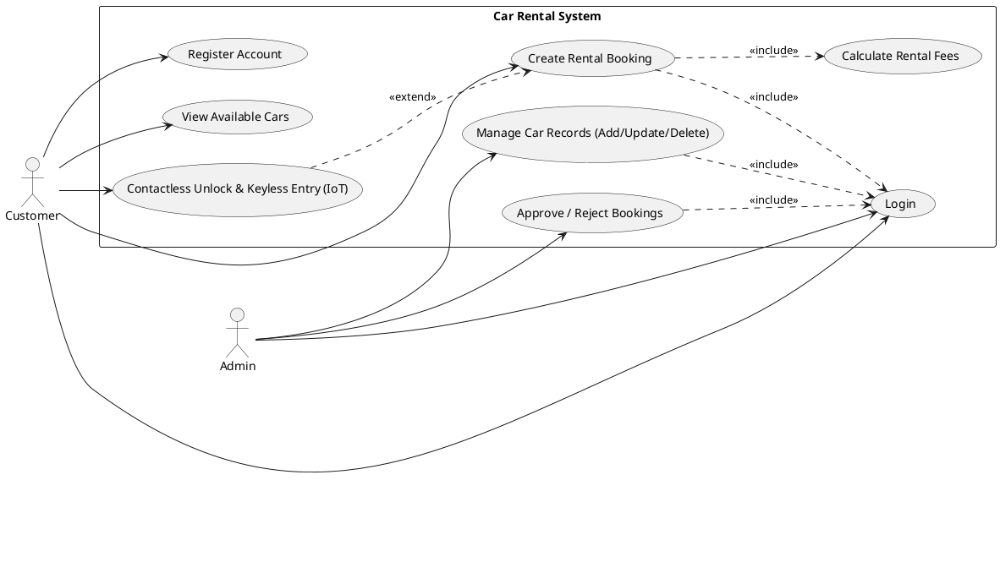

```plantuml
@startuml
left to right direction
skinparam packageStyle rectangle

actor "Customer" as customer
actor "Admin" as admin

rectangle "Car Rental System" {
  ' User Management
  usecase "Register Account" as UC_Reg
  usecase "Login" as UC_Log
  
  ' Car Management
  usecase "View Available Cars" as UC_ViewCars
  usecase "Manage Car Records (Add/Update/Delete)" as UC_ManageCars
  
  ' Rental Booking & Management
  usecase "Create Rental Booking" as UC_Booking
  usecase "Calculate Rental Fees" as UC_CalFees
  usecase "Approve / Reject Bookings" as UC_Confirm
  
  ' Task 2 Innovative Feature
  usecase "Contactless Unlock & Keyless Entry (IoT)" as UC_IoT
}

' Customer interactions
customer --> UC_Reg
customer --> UC_Log
customer --> UC_ViewCars
customer --> UC_Booking
customer --> UC_IoT

' Admin interactions
admin --> UC_Log
admin --> UC_ManageCars
admin --> UC_Confirm

' Relationships
UC_Booking ..> UC_CalFees : <<include>>
UC_Booking ..> UC_Log : <<include>>
UC_ManageCars ..> UC_Log : <<include>>
UC_Confirm ..> UC_Log : <<include>>
UC_IoT ..> UC_Booking : <<extend>>

@enduml
```